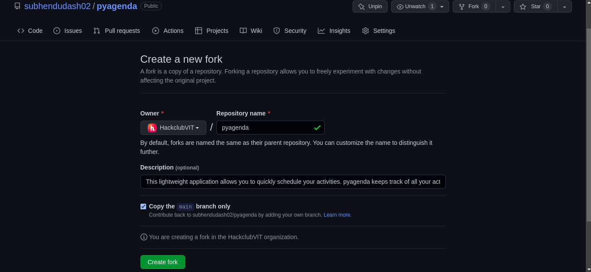
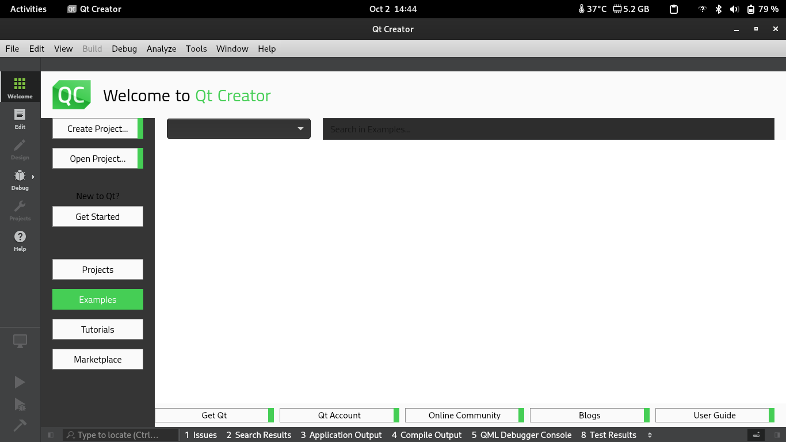
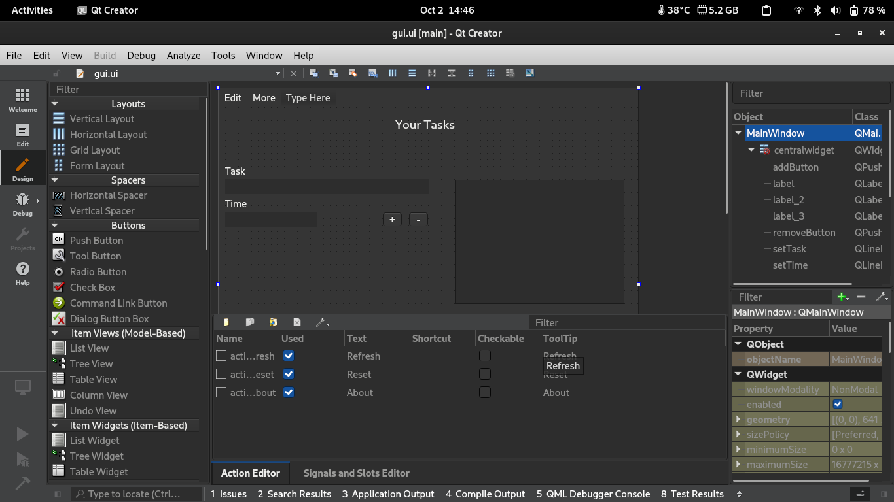
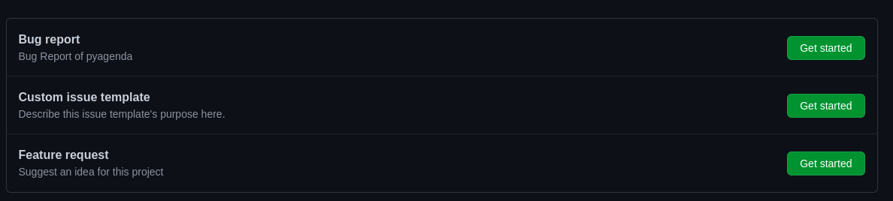
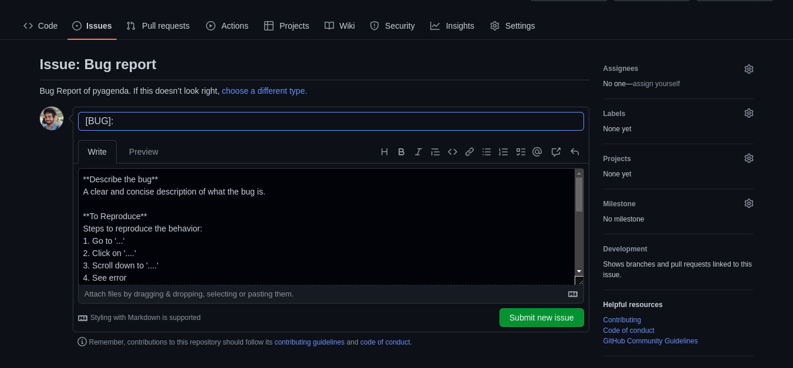
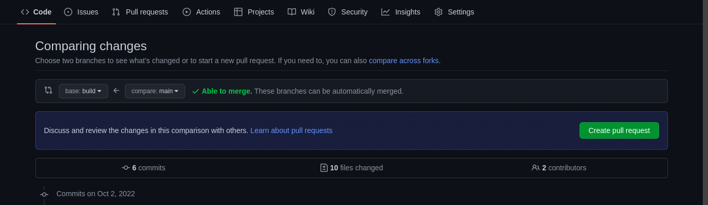

# Contributing Guidelines

Before contributing to the repository, read the following guidelines carefully so that you can create the issue and make a pull request correctly.

Before changing the codebase of the repository, make sure you have installed the following requirements: 
 - Python (3.7 or higher)
 - Qt Creator for Linux
 - crontab in Linux

# Git Flow and Setup

1. Go to [subhendudash02/pyagenda](https://github.com/subhendudash02/pyagenda) and click on fork button.



Change the owner where you want to fork and contribute.

2. Now, to clone the repository, type the following command in terminal (any directory).

```
git@github.com:<username>/pyagenda.git
```

**Note**: The `<username>` is the same you chose for the owner in the previous step.

3. Go to the directory.

```
cd pyagenda
```

4. Install all the dependencies.

```
pip3 install -r requirements.txt
```

For CLI part, it is easy to use, just follow the [list of commands](https://github.com/subhendudash02/pyagenda#commands) accordingly.

For GUI part, **don't change `gui_app.py` in `appUtil` file**. That python file is automatically generated after saving `gui.ui` XML file.

# GUI Setup

1. After installing QtCreator, open the software.



2. Go to "Debug", open `gui.ui` file.

3. You will get the layout as shown below.



Now you can change and add any components for the UI.

4. After changing the UI, save the changes. Go to `appUtil` folder and type the following command to compile the XML file to Python.

```
pyuic5 gui.ui > gui_app.py
```

Don't change the file name to anything else.

# Issues

1. Create a new issue before creating a PR otherwise your PR will be rejected.
2. Go to issues tab and press "New Issue" button.



3. Create a new issue by filling up the template given in the markdown. Select any one category - Bug report, custom issue template and feature request.



4. Further discussion can be done under that issue and accordingly we can assign you as the assignees.

# Pull Requests

1. After forking and cloning the repository, change the branch to `build`.

```
git checkout build
```

2. Now, make any changes you want in that branch. Don't make any changes to `main` branch.

3. Commit the changes and push the changes.

4. Make the pull request. Fill the template while making a PR.



Change the base branch to build branch of your forked repository.

# Writing better git commands

Before commiting the changes, make sure you follow the rules of writing a good git message.

The git message has the following format: 

```
<type>: <description>
```

`<type>` are of different types: 

 - `feat` – a new feature is introduced with the changes
 - `fix` – a bug fix has occurred
 - `chore` – changes that do not relate to a fix or feature and don't modify src or test files (for example updating dependencies)
 - `refactor` – refactored code that neither fixes a bug nor adds a feature
 - `docs` – updates to documentation such as a the README or other markdown files
 - `style` – changes that do not affect the meaning of the code, likely related to code formatting such as white-space, missing semi-colons, and so on.
 - `test` – including new or correcting previous tests
 - `revert` – reverts a previous commit

 **Source:** [link](https://www.freecodecamp.org/news/how-to-write-better-git-commit-messages/)

# Coding Guidelines

1. Name the meaningful variables.
2. Use `snake_case` for naming variables and function names.
3. Maintain **4 spaces** in VS Code and anywhere in the repository.
4. Comment the code especially in hard-to-understand areas.
