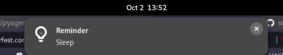
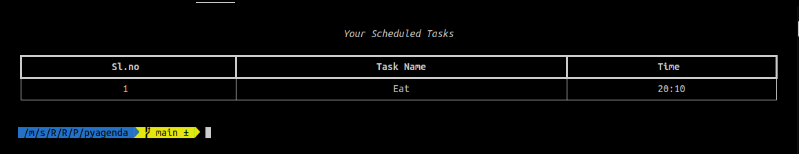
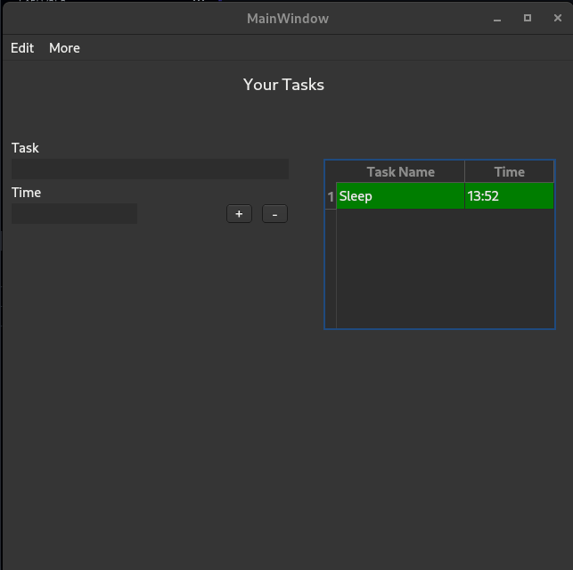

# pyagenda

  

This is the official pyagenda repository.

This lightweight application allows you to quickly schedule your activities.

pyagenda keeps track of all your activities and notifies you when they are due.

Both CLI and GUI are supported by pyagenda.

<b>Note: </b> For the time being, this app only runs on Linux. Windows support will be available soon (check `windows` branch for the windows task scheduler Python Script).

<br>

## Getting Started

1. Fork this repository.

2. Clone the repository.

```
git@github.com:<username>/pyagenda.git
```

3. Go to the directory

```
cd pyagenda
```

4. Install all the dependencies.

```
pip3 install -r requirements.txt
```

5. Run the following command

```
python3 -m pyagenda set_task <task-name> <time-scheduled>
```

That's it! You have scheduled a task.



**Note:**
 - Green highlighted task refers to the completed task.
 - Red highlighted task refers to the incomplete task.

<br>

## System Requirements

This app is supported in Linux as of now. So if you have any Linux distribution (Ubuntu, Fedora, Manjaro, etc.), you are good to go.

1. Python (3.7 or higher) and pip (21 or higher)

2. [crontab](https://en.wikipedia.org/wiki/Cron) if it is not installed.

3. Visual Studio Code ([install here](https://code.visualstudio.com/))

4. QtCreator for linux ([refer here](https://www.geeksforgeeks.org/how-to-install-qt-creator-on-linux/))

5. Git

**Note:** The installation process differs in different Linux distributions.

<br>

## Commands

1. Reset all the tasks

```
python3 -m pyagenda reset 
```

2. Display list of tasks in command line.

```
python3 -m pyagenda show_tasks
```



3. Start GUI application.

```
python3 -m pyagenda start_app
```



4. Set a task

```
python3 -m pyagenda set_task <task-name> <time-scheduled>
```

<br>

## Plans

 - [ ] GUI Improvements
 - [ ] Make package of this app
 - [ ] Add / Remove Tasks using [Textualize](https://github.com/Textualize) TUI library.
 - [ ] Add test cases to validate before merging PR.

<br>

## Contributing

**Note:** We are accepting contributions for [Hacktoberfest 2022](https://hacktoberfest.com). Make sure you visit the website and read the guidelines and sign up before contributing.


If you find any bugs / new feature to be added, don't hesitate to create a new issue. After approval, you may create a new pull request.

 - Make sure you read [contributing guidelines](https://github.com/subhendudash02/pyagenda/blob/main/CONTRIBUTING.md) first.

 - Follow our [code of conduct](https://github.com/subhendudash02/pyagenda/blob/main/CODE_OF_CONDUCT.md). Violation of any rule will lead to disqualification from Hacktoberfest 2022.

 - Follow PR template and issue template accordingly before creating any issue/PR.

<br>

## License

[Licensed](https://github.com/subhendudash02/pyagenda/blob/main/LICENSE) under MIT License

Copyright (c) 2022 Subhendu Dash
